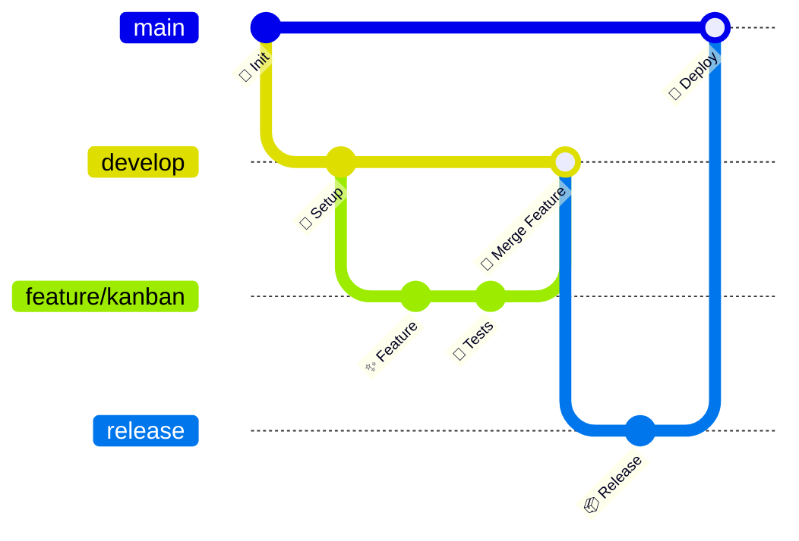

<div align="center">

<!-- Header animado -->


</div>

<!-- Typing animation -->
<div align="center">
  
</div>

<br/>

<!-- Social badges -->
<div align="center">

[](https://github.com/ltisistemas)
[](mailto:support@reloflow.com)
[](https://github.com/ltisistemas/reloflow-nextjs/issues)
[](https://github.com/ltisistemas/reloflow-nextjs/stargazers)

</div>

---

## 🧑‍💻 Sobre Nós


Somos a **LTI Sistemas**, uma equipe apaixonada por tecnologia e inovação. Acreditamos que boas ferramentas transformam a produtividade e a forma como as equipes colaboram.

Nossa missão é entregar **soluções web modernas**, robustas e escaláveis que simplifiquem a vida das pessoas — do planejamento à execução.

- 🏢 &nbsp; Empresa focada em **software B2B**
- 🎯 &nbsp; Especialistas em **gestão visual com Kanban**
- 🌐 &nbsp; Construindo aplicações **full-stack de ponta a ponta**
- 🧩 &nbsp; Obcecados por **UX limpa e experiências fluidas**
- 🔒 &nbsp; Comprometidos com **segurança e qualidade de código**
- 💡 &nbsp; Sempre explorando novas tecnologias e melhores práticas

---

## 🚀 Projeto em Destaque — Reloflow

<div align="center">

```
╔══════════════════════════════════════════════════════════╗
║   🗂️  RELOFLOW — Kanban Board de Nova Geração            ║
║   Gerencie projetos com elegância e velocidade           ║
╚══════════════════════════════════════════════════════════╝
```

</div>

> **Reloflow** é uma aplicação web moderna para gerenciamento de quadros Kanban com autenticação segura. Frontend poderoso em **Next.js** + backend robusto em **C# .NET 8**.

<div align="center">

| Funcionalidade | Status |
|---|---|
| 🗂️ Quadros Kanban com Drag & Drop | ✅ Disponível |
| 🔐 Autenticação segura | ✅ Disponível |
| 🎨 Tema claro/escuro | ✅ Disponível |
| 📱 Design responsivo | ✅ Disponível |
| 🔔 Notificações em tempo real | ✅ Disponível |
| 📊 Dashboard de produtividade | 🚧 Em desenvolvimento |

</div>

---

## 🛠️ Stack Tecnológica

### 🎨 Frontend

<div align="center">


</div>

### ⚙️ Backend

<div align="center">


</div>

### 🔧 Ferramentas & DevOps

<div align="center">


</div>

---

## 📊 Nosso Fluxo de Desenvolvimento



---

## 🏗️ Arquitetura do Projeto

```
reloflow-nextjs/
├── 📂 src/
│   ├── 📂 app/                   # Next.js App Router
│   │   ├── 📂 (private)/         # Rotas autenticadas
│   │   │   ├── 🏠 home/          # Dashboard principal
│   │   │   └── 🗂️ kanban/        # Gerenciador Kanban
│   │   └── 📂 (public)/          # Rotas públicas
│   │       └── 🔐 sign-in/       # Autenticação
│   ├── 📂 components/            # Componentes React
│   │   ├── 🎨 ui/                # Design System
│   │   ├── 🪝 hooks/             # Custom hooks
│   │   └── 🗺️ sidebar/           # Navegação lateral
│   └── 📂 lib/                   # Núcleo da aplicação
│       ├── 🌐 http-client.ts     # Cliente HTTP
│       ├── 🧩 domain/            # Modelos de domínio
│       ├── 🏛️ infrastructure/    # Camada de infra
│       └── ⚙️ application/       # Lógica de negócio
└── 📂 public/                    # Assets estáticos
```

---

## 🔄 CI/CD Pipeline

<div align="center">

[](https://github.com/ltisistemas/reloflow-nextjs/actions/workflows/feature-to-develop-pr.yml)
&nbsp;
[](https://github.com/ltisistemas/reloflow-nextjs/actions/workflows/develop-to-main-pr.yml)

</div>

```
feature/* ──PR auto──▶ develop ──PR auto──▶ main ──deploy──▶ 🌐 Produção
    │                     │                   │
    └── lint + build       └── tests           └── build + deploy
```

---

## 💡 Nossa Filosofia de Código

<div align="center">

| Princípio | Prática |
|-----------|---------|
| 🏗️ **Clean Architecture** | Domain → Application → Infrastructure |
| 🔷 **TypeScript First** | Tipagem forte em todo o projeto |
| ♿ **Acessibilidade** | Radix UI + ARIA attributes |
| 📱 **Mobile First** | Design responsivo com Tailwind CSS |
| 🔒 **Security by Default** | Autenticação + rotas protegidas |
| ⚡ **Performance** | SSR/SSG com Next.js App Router |

</div>

---

## 🤝 Como Contribuir

<div align="center">

```bash
# 1. Fork o repositório e clone localmente
git clone https://github.com/ltisistemas/reloflow-nextjs.git

# 2. Crie sua branch de feature
git checkout -b feature/minha-nova-feature

# 3. Instale as dependências
npm install

# 4. Inicie o servidor de desenvolvimento
npm run dev

# 5. Faça suas alterações e commit
git commit -m "✨ feat: adiciona nova feature incrível"

# 6. Push e abra um Pull Request
git push origin feature/minha-nova-feature
```

</div>

> 💡 **Dica:** Crie sua branch a partir de `develop`. O GitHub Actions criará automaticamente um PR para revisão!

---

## 📬 Contato & Suporte

<div align="center">

| Canal | Link |
|-------|------|
| 📧 **Email** | [support@reloflow.com](mailto:support@reloflow.com) |
| 🐛 **Reportar Bug** | [GitHub Issues](https://github.com/ltisistemas/reloflow-nextjs/issues) |
| 💡 **Sugerir Feature** | [GitHub Discussions](https://github.com/ltisistemas/reloflow-nextjs/discussions) |
| 📖 **Documentação** | [Wiki do Projeto](https://github.com/ltisistemas/reloflow-nextjs/wiki) |

</div>

---

<div align="center">

### ⭐ Se este projeto te ajudou, deixa uma estrela!

*Cada estrela nos motiva a continuar construindo coisas incríveis* 🚀

---


**Desenvolvido com ❤️ por [LTI Sistemas](https://github.com/ltisistemas) — © 2026**

</div>
