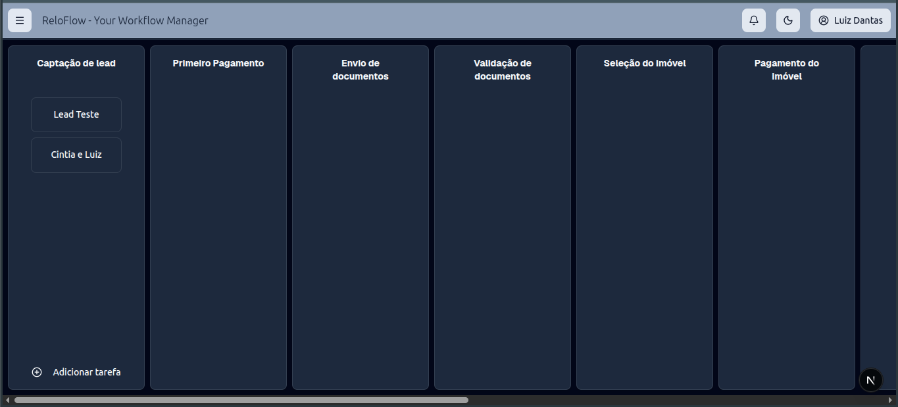

# 🚀 Reloflow


## 📋 Sobre o Projeto

Reloflow é uma aplicação web moderna para gerenciamento de kanban com autenticação segura. O sistema é composto por um frontend inovador em Next.js e um backend robusto em C# .NET 8.

---

## � Preview

<div align="center">
  
</div>

---

## �🛠️ Stack Tecnológico

### Frontend (Este Repositório)

- **Next.js 16.1.6** - Framework React com SSR/SSG
- **React 19.2.3** - Biblioteca UI moderna
- **TypeScript 5** - Tipagem estática
- **Tailwind CSS 4** - Estilização utilitária
- **Radix UI** - Componentes acessíveis
- **dnd-kit** - Drag & Drop avançado
- **Sonner** - Sistema de notificações elegante

### Backend

- **C# .NET 8** - Framework principal
- **Entity Framework Core** - ORM para dados
- **Web API REST** - Arquitetura de serviços
- **PostgreSQL** - Banco de dados relacional

---

## 🚀 Quick Start

### Pré-requisitos

- **Node.js** 18+ e npm (ou yarn/pnpm)
- **.NET 8 SDK** (para o backend)
- **PostgreSQL** 12+ (para o banco de dados)

### 1️⃣ Instalação Frontend

```bash
# Clone o repositório
git clone <seu-repositorio>
cd reloflow-nextjs

# Instale as dependências
npm install
```

### 2️⃣ Configuração do Backend

```bash
# Clone o repositório do backend
git clone <seu-repositorio-backend>
cd seu-backend

# Restaure as dependências
dotnet restore

# Configure o banco de dados
dotnet ef database update

# Execute o servidor
dotnet run
```

### 3️⃣ Variáveis de Ambiente

Crie um arquivo `.env.local` na raiz do projeto frontend:

```env
NEXT_PUBLIC_API_URL=http://localhost:5000
```

### 4️⃣ Rodando o Projeto

```bash
# Terminal 1 - Frontend (Next.js)
npm run dev
```

O frontend estará disponível em **http://localhost:3000**

---

## 📁 Estrutura do Projeto

```
src/
├── app/                          # App Router do Next.js
│   ├── (private)/                # Rotas protegidas
│   │   ├── home/                 # Dashboard principal
│   │   └── kanban/               # Gerenciador de kanban
│   └── (public)/                 # Rotas públicas
│       └── sign-in/              # Página de autenticação
├── components/                   # Componentes React
│   ├── ui/                       # Componentes UI reutilizáveis
│   ├── hooks/                    # Custom hooks
│   └── sidebar/                  # Sidebar layout
├── lib/                          # Utilitários e serviços
│   ├── http-client.ts            # Cliente HTTP customizado
│   ├── utils.ts                  # Funções auxiliares
│   ├── domain/                   # Modelos de domínio
│   ├── infrastructure/           # Camada de infraestrutura
│   └── application/              # Lógica de aplicação
└── public/                       # Ativos estáticos
```

---

## 🔧 Scripts Disponíveis

| Script          | Descrição                            |
| --------------- | ------------------------------------ |
| `npm run dev`   | Inicia o servidor de desenvolvimento |
| `npm run build` | Build para produção                  |
| `npm run start` | Executa o build de produção          |
| `npm run lint`  | Executa linter ESLint                |
| `npm test`      | Executa testes                       |

---

## 🔗 Integração com Backend

O frontend comunica com o backend via HTTP REST. Certifique-se de que:

1. ✅ O servidor .NET está rodando na porta configurada
2. ✅ A variável `NEXT_PUBLIC_API_URL` aponta para o servidor correto
3. ✅ O banco PostgreSQL está acessível pelo backend

### Exemplo de Chamada API

```typescript
// lib/http-client.ts - Cliente HTTP pré-configurado
const response = await fetch(`${process.env.NEXT_PUBLIC_API_URL}/api/endpoint`);
```

---

## 🔐 Autenticação

O sistema utiliza um modelo de autenticação seguro com credenciais. Verifique as policies de segurança no backend .NET.

---

## 📝 Testes

```bash
# Executar testes
npm run test

# Testes com cobertura
npm run test -- --coverage
```

---

## 🚢 Deploy

### Frontend (Vercel)

```bash
npm run build
# Push para Vercel (integração automática)
```

### Backend (.NET)

```bash
dotnet publish -c Release
```

---

## 📚 Recursos Úteis

- [Next.js Docs](https://nextjs.org/docs)
- [React Docs](https://react.dev)
- [Tailwind CSS](https://tailwindcss.com)
- [Radix UI](https://www.radix-ui.com)
- [dnd-kit Documentation](https://docs.dndkit.com)
- [.NET Documentation](https://docs.microsoft.com/dotnet)
- [Entity Framework Core](https://learn.microsoft.com/en-us/ef/core)

---

## 📄 Licença

Este projeto está sob licença privada. Todos os direitos reservados © 2026

---

## 👥 Contribuição

Para contribuir ao projeto:

1. Crie uma branch para sua feature (`git checkout -b feature/AmazingFeature`)
2. Commit suas mudanças (`git commit -m 'Add some AmazingFeature'`)
3. Push para a branch (`git push origin feature/AmazingFeature`)
4. Abra um Pull Request

---

**Desenvolvido com ❤️ por LTI Sistemas**
